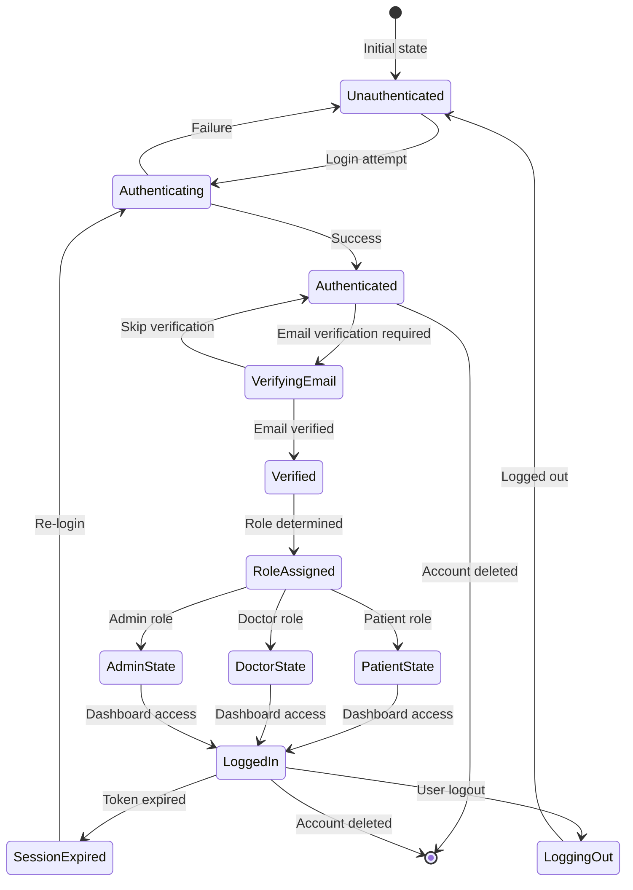
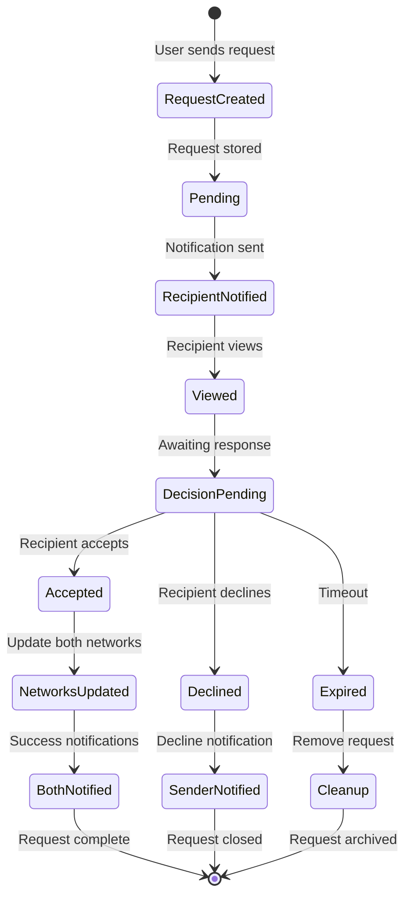
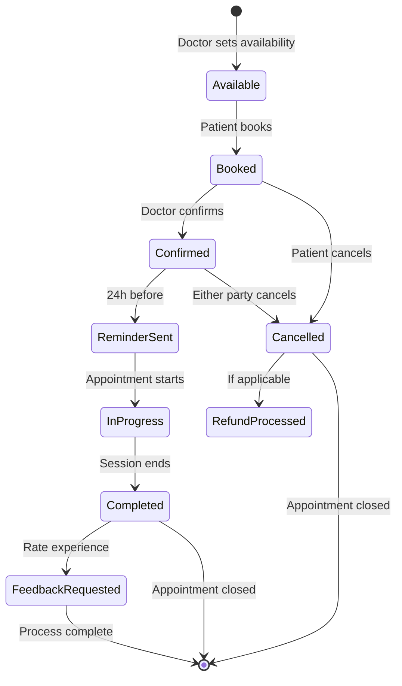
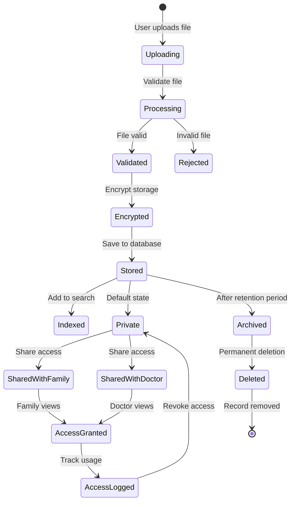
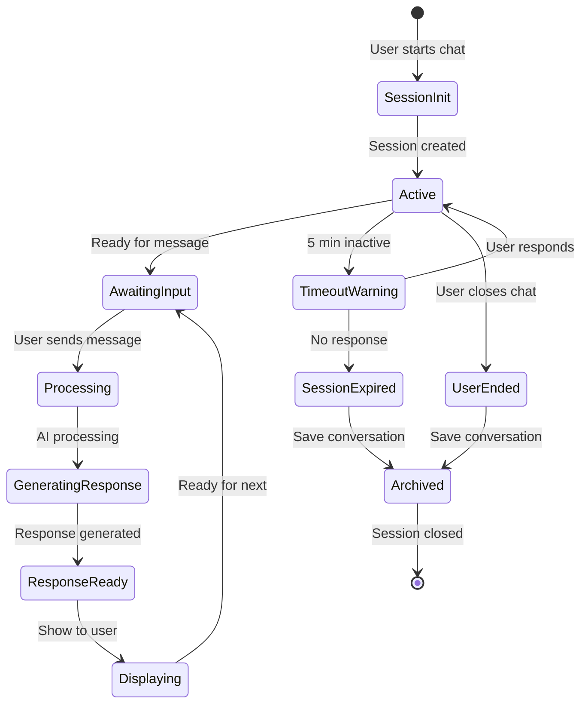
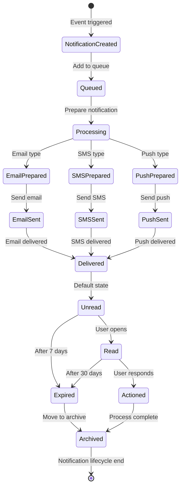
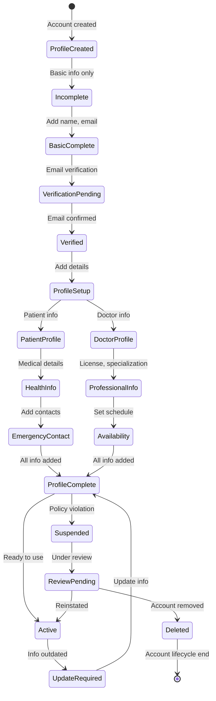

# State Diagrams - Swasthyalink Platform

## 1. User Authentication State


## 2. Family Request Lifecycle


## 3. Appointment States


## 4. Health Record States


## 5. Chatbot Session States


## 6. Notification States


## 7. User Profile States


## 8. System Health Monitoring
```mermaid
stateDiagram-v2
    [*] --> MonitoringActive: System online
    
    MonitoringActive --> Healthy: All metrics normal
    Healthy --> Warning: Threshold exceeded
    
    Warning --> Investigating: Check logs
    Investigating --> IssueFound: Problem identified
    
    IssueFound --> Resolving: Fix in progress
    Resolving --> Testing: Verify fix
    
    Testing --> Healthy: Issue resolved
    Testing --> Critical: Fix failed
    
    Critical --> Escalating: Alert team
    Escalating --> EmergencyMode: Reduced functionality
    
    EmergencyMode --> Recovery: Restore services
    Recovery --> Testing: Verify recovery
    
    Healthy --> Maintenance: Scheduled maintenance
    Maintenance --> Testing: Verify changes
    
    MonitoringActive --> [*]: System shutdown
